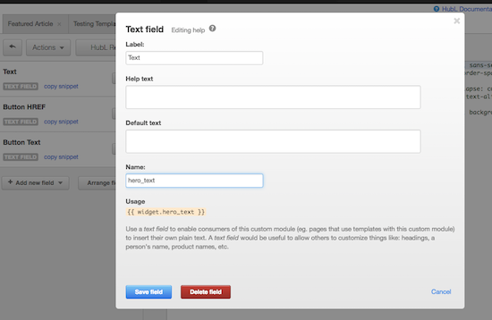

# Liferay.com Email Builder
The automagic builder that can 1) build tested components for Hubspot and 2) build fully-responsive HTML emails as painless as email building can be.

## Table of Contents
1. [Getting Started](#getting-started)
2. [Creating Hubspot Email Components](#creating-hubspot-email-components)
    - [Create a New Component](#create-a-new-component)
    - [Making Changes to Components](#making-changes-to-components)
    - [Hubspot Variables](#hubspot-variables)
    - [Sending a Component to Test](#sending-a-component-to-test)
    - [Transferring Components to Hubspot](#transferring-components-to-hubspot)
3. [Creating HTML Emails](#creating-html-emails)
    - [Creating a New HTML Email](#creating-a-new-html-email)
    - [Making Changes to Emails ](#making-changes-to-emails)
    - [Component Includes](#component-includes)
    - [Sending an Email to Test](#sending-an-email-to-test)
4. [How the System Works](#how-the-system-works)
    - [Overview](#overview)
    - [Email Global Styles](#email-global-styles)
    - [Inky](#inky)
    - [Hubspot Email Settings](#hubspot-email-settings)
    - [Live Reload](#live-reload)

## Getting Started

The gateway to do everything: 

1. Clone repo
2. [Install node](https://nodejs.org/en/) (if you haven't)
3. Install [Gulp](http://gulpjs.com/) `npm install -g gulp`
4. Install all dependencies with `npm install` from your terminal in the root directory.

*Note For Windows users: You may need to configure SASS after step 4 with `npm rebuild node-sass`*

## Creating Hubspot Email Components
To create, update, test, and transfer custom and bullet-proof email components to Hubspot. 

[Video Tutorial](https://www.youtube.com/watch?v=HRHIBYca23U)

<iframe width="560" height="315" src="https://www.youtube.com/embed/HRHIBYca23U" frameborder="0" allowfullscreen></iframe>

#### Create a New Component:

```
gulp create --component [component-name]
```

This will create a new component in `src/components`. In it are:

```
/components
    /[component-name]
        src.html    // HTML for your component
        styles.css  // CSS for your component
        test.html   // (Don't edit) Preview your component with all Hubspot/Global Styles
        dist.html   // (Don't edit) What you copy and paste into Hubspot
```

#### Making Changes to Components

```
gulp
```

*Hooray*, we're watching for all changes now and 1) inline styling 2) applying global styling 3) wrapping it Hubspot base 4) spitting out all the html in `dist.html` and `test.html`

#### Hubspot Variables
To make component content able to be driven by content authors and not coders, Hubspot allows for data structures as variables for their components.

In Hubspot, when you create components, they will ask you to create the data structure for your component:



Then, in your code, just include the variable in:

Example:
```
{{widget.hero_text}}
```

Read more about Hubspot's scripting language: 
http://designers.hubspot.com/docs/cos/custom-modules
http://designers.hubspot.com/docs/hubl/intro-to-hubl

#### Sending a Component to Test 
See your component tested in Litmus:

```
gulp test --component [component-name]
```

#### Transferring Components to Hubspot
Unfortunately, there's no way to automatically create components in Hubspot. So what you'll basically do is copy the contents of `dist.html` to your Custom Module. This is similar to relationship between the lrdcom repo and templates in Liferay.com

## Creating HTML Emails
We often have to send full HTML emails. Create fully responsive and tested emails in minutes with a few commands.

[Video Tutorial](https://www.youtube.com/watch?v=_ns_uZXizbo&feature=youtu.be)

#### Creating a New HTML Email
```
gulp create --email [email-name]
```

This will create a new email in `src/emails`. In it are:

```
/emails
    /[email-name]
        src.html    // HTML for your email
        styles.css  // CSS for your email
        dist.html   // (Don't edit) Your fully baked HTML email
```

#### Making Changes to Emails

```
gulp
```

*Hooray*, we're watching for all changes now.

#### Component Includes
You can include components that you've built for hubspot. Anywhere in your HTML email:

```
{{components.[component-name]}}
```

This will only work for components with hard-coded content and not those with hubspot variables.

#### Sending an Email to Test 
See your email tested in Litmus:

```
gulp test --email [email-name]
```

## How the System Works
Here's some details to understand how the system works and features you may want to leverage.

#### Overview

This is how the build system works:

<div style="text-align:center"></div>

What's what:
- **Hubspot Styles and Infrastructure** (`/src/base/`)
The base is used to create a code environment as close to Hubspot as possible so that when component are being built, it should reflect what you see on Hubspot.com. what base archictecture for emails. This should include all code that Hubspot uses. 
- **Global Email Styles** (`/src/styles`) - This will contain global styles that will apply to every component. `main.css` is the final file that will be included in every component.
- **Custom Components** (`/src/base/components`) - Where our collection of components go.

#### Email Global Styles
In `/src/styles` you'll find global styles for all components.

- This allows global theming and styling as it will write css for every component. 
- Supports SASS. 
- If you have `gulp` running, it will automagically process and update all components on save. 

#### Inky
This email builder has [Inky](https://foundation.zurb.com/emails/) fully integrated.

For any components, you can leverage any of the Inky syntax and it will spit out correct styling and HTML. Note: For components, don't rely so much on the Inky grid system as we are locked into Hubspot's grid system.

[Read Inky Docs](https://foundation.zurb.com/emails/docs/inky.html)

#### Hubspot Email Settings
Some of Hubspot's email setting styles are found in `config.js`. These will affect the base, which will then affect how components are viewed.

#### Live Reload
[LiveReload](https://chrome.google.com/webstore/detail/livereload/jnihajbhpnppcggbcgedagnkighmdlei?hl=en) is a Chrome plugin that allows for auto reload when changes to a page are made and the page is saved. To leverage this during development:

1. [Install the plugin](https://chrome.google.com/webstore/detail/livereload/jnihajbhpnppcggbcgedagnkighmdlei?hl=en)
2. Allow for local URLs (Extensions -> Check "Allow Access to File URLs")
3. Run `gulp`
4. Check the Livereload Button in Chrome Toolbar (Make sure the dot is filled)
